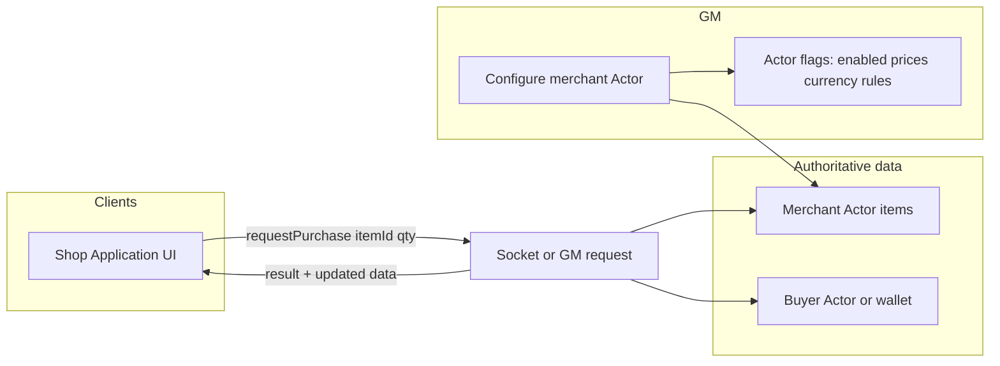

# Foundry v13 interactive merchant module

**Overview:** Scaffold a Foundry v13 module in this repo that treats a configured Actor (typically loot/container) as shop inventory, exposes a custom purchase UI to players, and validates purchases on the server so stock and currency stay authoritative.

## Implementation checklist

- [ ] Add `module.json` (v13 compat), scripts entry, lang stub, empty CSS
- [ ] Actor sheet header button + merchant flags + optional small config form
- [ ] Application + Handlebars template: list stock, prices, currency display (read-only)
- [ ] Socket protocol + server validation + item/currency updates + client feedback
- [ ] Smoke-test in v13: GM setup, player join, buy, out-of-stock, insufficient funds

## Goals (aligned with your choices)

- **Platform**: Foundry **v13** only for the first ship (simpler than dual-version shims).
- **MVP**: GM marks an **Actor** as a merchant whose **items = stock**; **players** open a **buy UI** that shows **price, availability, and currency**; purchases **update the merchant actor and the buyer** only after **server-side** validation.

## Conceptual model

- **Merchant identity**: One `Actor` document (loot/container type is fine) whose embedded `Item` collection is **stock**. Selling an item can mean transferring a physical stack from merchant → buyer, or decrementing quantity on a stackable item (your rule set can be explicit in v1).
- **Prices**: Store per-item or per-merchant defaults via **`Actor#flags[moduleId]`** and/or **`Item#flags`**. Avoid editing core item `system` fields unless you commit to a specific system (e.g. D&D5e); flags keep the module **system-agnostic** at first.
- **Currency**: Same story—start with **module-owned flags** on the buyer actor (e.g. `{ gp: 10, sp: 2 }`) or a documented hook for “getBalance / debit / credit” so you can later plug in **dnd5e** currency without rewriting the UI.
- **Authority**: All mutations (`createEmbeddedDocuments`, `updateEmbeddedDocuments`, `deleteEmbeddedDocuments`, currency changes) run **only on the server** (GM user or `game.user.isGM` checks in a socket handler). Clients only render and send **intent** messages.

## Repo layout (greenfield)

Today the repo only has [README.md](../../../README.md). Add a standard module tree:

| Path | Purpose |
|------|---------|
| `module.json` | Manifest: `id`, `title`, `compatibility.minimum` = 13, `esmodules`, optional `styles` |
| `scripts/` or `src/` | Entry `merchants.mjs` (or `.ts` if you add a build step—**plain ESM in `scripts/` is fine for v1**) |
| `templates/` | Handlebars for shop window (item rows, totals, errors) |
| `styles/merchants.css` | Layout for the shop app |
| `lang/en.json` | i18n keys for labels |

Optional later: `packs/` for sample merchant macro, `assets/` for icons.

## Implementation phases (steady detail)

### Phase 1 — Scaffold and GM configuration

- **`module.json`**: register one `esmodule` entry; set `relationships.systems` empty or note “any” until you lock system support.
- **Boot**: `Hooks.once("init", …)` register `CONFIG.Actor` flags schema (if using `foundry.data.fields`) or document flag shape in code; `Hooks.once("ready", …)` for anything needing `game.actors`.
- **GM affordance**: Minimal path to “this actor is a merchant”:
  - **Option A (fastest)**: Header button on eligible actor sheets (“Open as shop” / “Configure merchant”) via `Hooks.on("getActorSheetHeaderButtons", …)`.
  - **Option B**: Separate tiny **MerchantConfig** `FormApplication` opened from that button to edit flags (markup %, welcome text, accepted currencies).
- **Persistence**: `actor.setFlag(moduleId, "merchant", { enabled, … })`.

### Phase 2 — Shop UI (read-only first)

- Implement a **Foundry Application** (v13: prefer patterns consistent with core—`ApplicationV2` if you want to align with newer UI, or classic `Application` for fewer surprises; pick one and stay consistent).
- **Open rules**: GM always; players only if `merchant.enabled` and you define visibility (e.g. any player within scene, or any logged-in user—**start with “any player can open if they know the actor”** via a journal link or macro, then tighten).
- **Render data**: Serialize merchant items + resolved prices + stock counts to a plain object for Handlebars (no direct `Document` mutation in the template layer).
- **Localization**: wire all user-visible strings through `game.i18n.localize`.

### Phase 3 — Purchase pipeline (MVP complete)

- **Client → server**: Register a **socket** (`game.socket.on`) namespace `module.<id>` (or Foundry’s `emit` pattern your version documents). Payload: `{ type: "purchase", merchantId, buyerId, itemUuid, quantity }`.
- **Server handler**:
  - Validate users, existence of actors/items, stock, price, buyer balance.
  - Perform updates in a short transaction-like sequence; on failure return structured error codes for the UI.
  - Optionally wrap in `Actor#updateEmbeddedDocuments` batch where possible.
- **UI feedback**: Disable button while in-flight; toast or inline error from socket response.
- **Logging**: `ui.notifications` for GM on suspicious requests (optional flag `debug`).

### Phase 4 — Polish and system hooks (post-MVP)

- **dnd5e** (if you adopt it): map module currency to `actor.system.currency` and item prices from `item.system.price` where sensible; keep flags as override.
- **Drag-drop** merchant token → auto-open shop for double-click (hook `renderTokenHUD` or token click—careful with UX).
- **Restock** tools for GM (duplicate item from compendium, reset flags).
- **Tests**: if you add TypeScript/build, add minimal unit tests for price resolution; otherwise manual test checklist in PR template (not a new doc file unless you ask).

## Risks and decisions baked into this plan

- **System coupling**: Staying **flags-first** avoids breaking non-dnd5e worlds; you explicitly trade “zero config” for “works everywhere.”
- **Sockets vs `executeAsGM`**: Sockets are explicit and work when the GM is connected; document that **purchases require an active GM** for v1.
- **Item transfer semantics**: Decide v1 rule in code comments: “always transfer full Item stack” vs “decrement quantity field if present”—pick one to avoid duplicate items.

## What we are not doing in v1

- Full crafting, haggling, reputation, or dynamic pricing unless you expand scope.
- World-level economy without an actor wallet.
- Automated tests inside Foundry (possible later with `quench` or manual QA list).

## Next step after you approve

Implement Phase 1–3 in this repo: manifest, entry script, one header button, flags schema, shop `Application`, socket purchase handler, and minimal CSS/templates—then you can iterate on UX and dnd5e integration.
